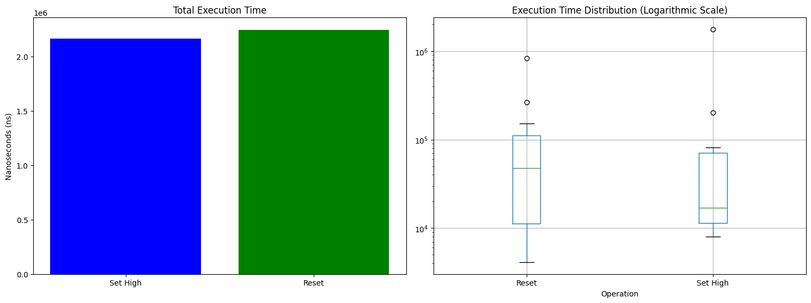

# Benchmark

The benchmark was conducted on a 5-bit memory used in the examples from the [Advanced Circuits](tutorials/advanced-circuits.md). The test measured two main operations:

1. **Setting high states (times_high)**  
   The execution time of the `updateGate` method was measured, which updates the gate state and retrieves the input value (I/O). The result represents the total nanoseconds taken to set all memory inputs to a high state.

2. **Resetting the entire memory (times_reset)**  
   This test measured the total time required to reset the entire 5-bit memory, also expressed as the sum of nanoseconds.

## Measurement Results

#### Setting High States (times_high):
- **Total Time:** 2,165,000 ns  
- **Average:** 216,500 ns  
- **Median:** 16,950 ns  
- **Minimum:** 8,000 ns  
- **Maximum:** 1,766,200 ns  
- **Standard Deviation:** 519,676 ns  

#### Memory Reset (times_reset):
- **Total Time:** 2,246,000 ns  
- **Average:** 102,091 ns  
- **Median:** 47,450 ns  
- **Minimum:** 4,100 ns  
- **Maximum:** 827,400 ns  
- **Standard Deviation:** 170,616 ns

## Server Specifications  

This benchmark was executed on the following server configuration:  

- Server Software: Paper version git-Paper-196 (MC: 1.20.1)  
- API Version: 1.20.1-R0.1-SNAPSHOT (Git: 773dd72)  

System Info:

- Java: 21 (OpenJDK 64-Bit Server VM 21.0.6+7-LTS)  
- Host OS: Windows 11 10.0 (amd64)