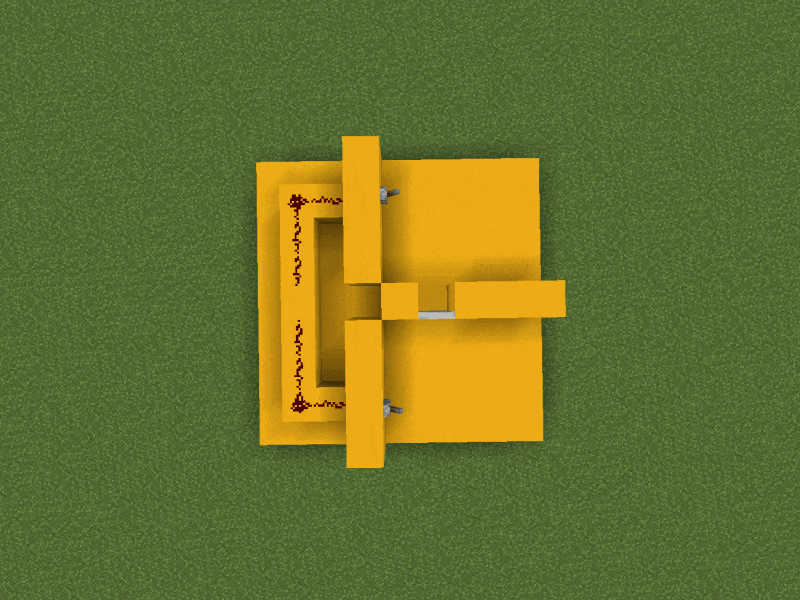

# Create the First Gate

Hello! We are about to create our first logic gate using the plugin. With it, we will build a door opening mechanism. Two levers will be able to open the same door from both sides.

For this mechanism, we will use an XOR gate (by default, the carpet color is red).

First, make sure you have the proper permissions to build gates, namely `logicgates.place`, `logicgates.break`, `logicgates.give`, and `logicgates.rotate`. These four permissions should be more than enough for basic operation.

## Step One

To build the mechanism, we will lay the foundations for its construction. We will use iron doors, two levers, and some redstone dust. We will also build a simple room with Yellow Concrete.

Then, add levers on both sides to control the iron doors. Connect redstone signal from the levers to the gate block. Currently, the space for the glass (the gate) is empty, as seen in the visualization.

## Step Two

Place a glass block in the empty space (between redstone wire's).

Type the command:  
`/logicgates give XOR`  
(First, ensure that you have the `logicgates.give` permission.)

You will receive a red carpet, which you should place on the glass block. This will create the XOR gate, and you should see the following message in chat:

> Created XOR gate!

Green particles represent the output of the logic gate. Blue and red particles indicate the inputs of the logic gate.

The output should be directed towards our iron doors. If this is not the case, you can rotate the gate using `/logicgates rotate`.

## Step Three

Connect the output of the gate to the iron doors. As output expanders, use switch-type components that are safe and do not cause errors, unlike, for example, repeaters, comparators, or redstone wire.

On the wall at the gate's output, place a wooden/stone button. Under the button, place redstone dust and connect it to a repeater directed towards the block that will power the iron doors.

## Done!

Your first mechanism using an XOR gate is ready. Test it out. Flip the first lever and go through the iron doors. On the other side, flip the second lever, which will close the iron doors. Flip the lever once again to open them.

The plugin simulates pressing that button at the gate's output, which activates the redstone wire beneath the button.